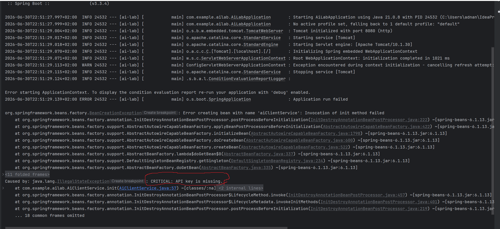
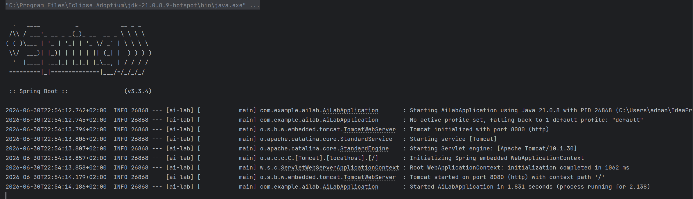
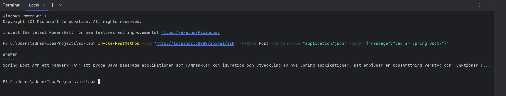

# Individuell Labb 1k5 - AI-integration (G)

Spring Boot-app som pratar med OpenAI:s API. Målet med labben var inte bara
att få ett svar tillbaka från AI:n, utan att bygga in lite skydd runt
anropet så att appen inte kraschar om något går fel.

## Vad jag har gjort

**API-nyckeln ligger inte i koden.** Den laddas in via miljövariabeln
`OPENAI_API_KEY` och läses i `AiClientService` med `@Value`. Om nyckeln
saknas när appen startar kraschar den direkt med ett tydligt felmeddelande
(`CRITICAL: API key is missing.`) istället för att krascha senare när någon
faktiskt försöker använda AI-funktionen. Se `evidence/fail-fast-missing-api-key.png`.

**Timeouts.** AI-anrop kan ta tid, och om OpenAI hänger sig vill jag inte
att min server ska sitta och vänta för evigt. Connect-timeout är satt till
2 sekunder och read-timeout till 8 sekunder via `SimpleClientHttpRequestFactory`.

**Prompt.** Jag skickar en systemprompt som säger till AI:n att svara kort,
på svenska, utan markdown. Temperature är satt till 0.1 för att svaren ska
bli mer förutsägbara och inte variera så mycket mellan anrop.

**Felhantering.** Om HTTP-anropet till OpenAI misslyckas (t.ex. timeout)
fångas det i en try/catch och appen returnerar ett standardmeddelande
istället för att krascha. Samma sak om svaret från OpenAI inte går att
tolka som JSON - då returneras också ett fallback-meddelande.

## Vad jag INTE har gjort (medvetet)

Jag siktar på G, inte VG, så jag har skippat:
- Exponential backoff vid 429 (rate limit)
- En riktig DTO med Bean Validation mot AI-svaret
- Stresstester av kantfall
- Den skriftliga utvärderingen som krävs för VG

Om jag senare vill höja till VG vet jag vad som saknas.

## Projektstruktur

```
ai-lab/
├── pom.xml
├── README.md
├── Bevis/
│   ├── fail-fast-missing-api-key.png
│   ├── app-started-successfully.png
│   └── successful-ai-call.png
└── src/main/
    ├── java/com/example/ailab/
    │   ├── AiLabApplication.java
    │   ├── AiClientService.java
    │   └── AiController.java
    └── resources/
        └── application.properties
```

## Köra projektet

Kräver Java 21 och en OpenAI API-nyckel.

Sätt miljövariabeln innan du startar appen (i IntelliJ: Run -> Edit
Configurations -> Environment variables):

```
OPENAI_API_KEY=din-nyckel
```

Starta sedan `AiLabApplication`. När appen kör på port 8080 kan man testa
den med:

```powershell
Invoke-RestMethod -Uri "http://localhost:8080/api/ai/ask" -Method Post -ContentType "application/json" -Body '{"message":"Vad ar Spring Boot?"}'
```

## Bevis på testning

**Fail-fast när nyckeln saknas:**



**Appen startar normalt med giltig nyckel:**



**Lyckat AI-anrop:**



## Problem jag stötte på

Råkade av misstag skapa en Maven-submodul när jag försökte lägga till en
mapp för bevis, vilket lade till en `<modules>`-tagg i pom.xml och
förstörde hela build-konfigurationen (output path, language level, allt).
Löste det enklast genom att packa upp projektet på nytt från en tidigare
sparad version och sätta in nyckeln igen, istället för att fixa varje
trasig inställning manuellt.